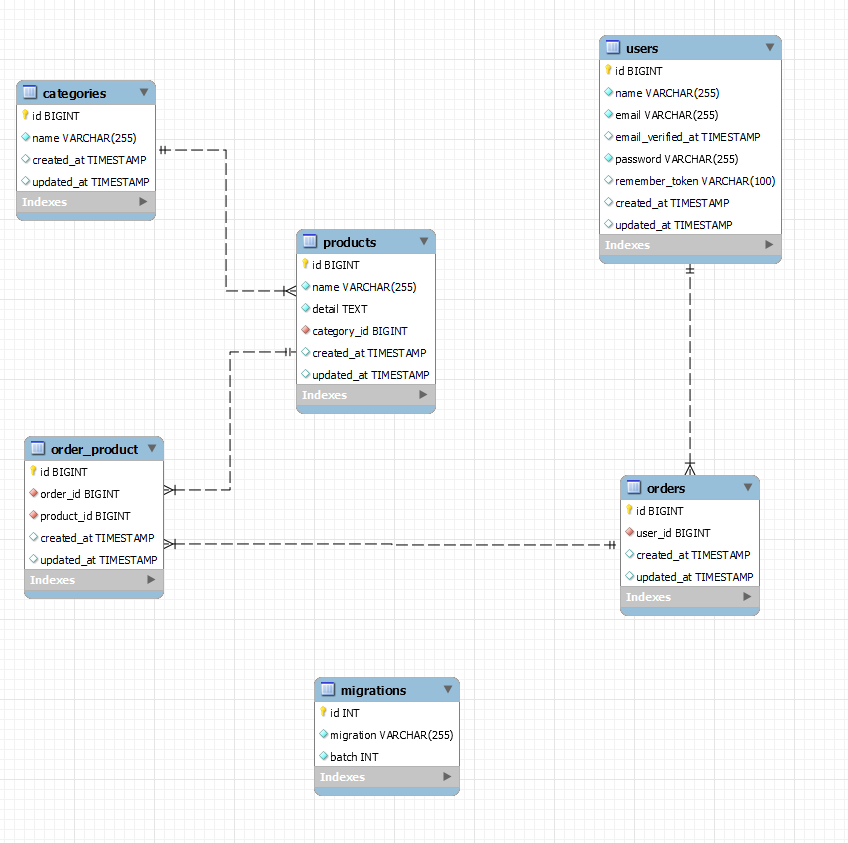

## 1. 新建一個 Model
   * 除了原本內建的 User Model 之外，再建立一個 Product Model，並建立對應的 migration 檔案
## 2. 以此產生CRUD功能，以API方式呈現
   * 針對 User Model 及 Product Model 分別建立 CRUD，並建立  <a href="https://app.swaggerhub.com/apis-docs/S13602507586/wasateam/1.0.0" target="_blank">API</a> 文件
## 3. 將 Model 建立 BelongsTo, HasMany, BelongsToMany 的關聯，建立對應關係需要的 Model
* **雖建立 BelongsTo, HasMany, BelongsToMany 的關聯，但並未建立相關 API**
* User 與 Product 之間的 HasMany 關聯：一個 User 可擁有多個 Product。
* Product 與 Category 之間的 BelongsTo 關聯：一個 Product 屬於一個 Category。
* Order 與 Product 之間的 BelongsToMany 關聯：一個 Order 可包含多個 Product，一個 Product 可屬於多個 Order。
   
## 4. 針對 API 撰寫出一份SD文件，功能情境不拘
* 未完成

[筆記](https://fluff-surgeon-d14.notion.site/PHP-Laravel-1c8f7dc5e6f845db819db4b79eb6a810)
